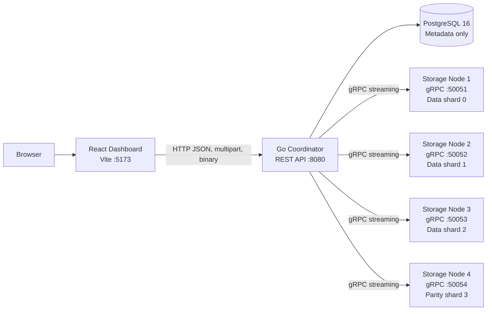
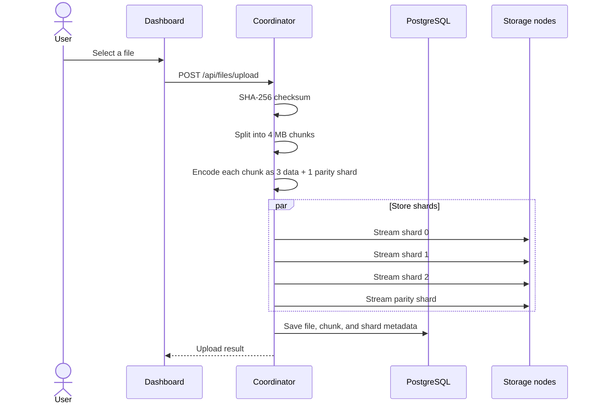
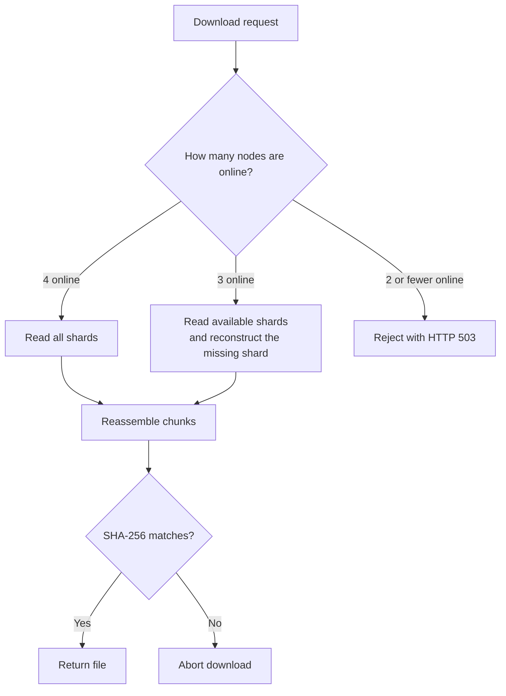

# DistFS

Distributed file storage with a Go coordinator, four gRPC storage nodes, PostgreSQL metadata, and Reed-Solomon erasure coding.

Each file is split into 4 MB chunks. Every chunk is encoded as three data shards and one parity shard (`3 + 1`), so the cluster can reconstruct a file when one storage node is unavailable.

## Architecture



PostgreSQL stores metadata only. The raw shard files live on the storage-node data volumes.

### Upload flow



### Download and reconstruction flow



## Technology

- Go 1.22+
- Gin REST API
- gRPC and Protocol Buffers
- Reed-Solomon erasure coding (`3` data shards + `1` parity shard)
- PostgreSQL 16
- React 18, Vite, and Tailwind CSS
- Docker Compose

## Run Locally with Docker Compose

### Prerequisites

- [Docker Desktop](https://docs.docker.com/get-docker/)
- Git

### Start the cluster

From the repository root:

```powershell
git clone https://github.com/abhinavtiwari77/DistFS.git
cd DistFS
docker compose up --build -d
```

This starts seven services:

- `postgres`
- `storage-node-1`
- `storage-node-2`
- `storage-node-3`
- `storage-node-4`
- `coordinator`
- `dashboard`

Open the dashboard at [http://localhost:5173](http://localhost:5173).

Check the services and API health:

```powershell
docker compose ps
curl http://localhost:8080/api/health
```

The coordinator runs the SQL migrations automatically when it starts.

### View logs

```powershell
docker compose logs -f coordinator
docker compose logs -f dashboard
```

### Stop or reset the cluster

Stop the containers while keeping database and shard volumes:

```powershell
docker compose down
```

Delete the containers and all stored data:

```powershell
docker compose down -v
```

Do not use `-v` unless you intentionally want to delete uploaded files and metadata.

## Deploy on a VPS

The existing Compose setup is best suited to a Linux VPS because all services share one private Docker network and the storage-node hostnames already match the seeded database addresses.

Recommended starting size:

- Ubuntu 22.04 or 24.04
- 2 vCPUs
- 4 GB RAM
- At least 50 GB of persistent disk, depending on file volume

Install Docker and Git on the server, then run:

```bash
git clone https://github.com/abhinavtiwari77/DistFS.git
cd DistFS
docker compose up --build -d
docker compose ps
```

For a temporary private deployment, open only the dashboard port and API port:

```bash
sudo ufw allow OpenSSH
sudo ufw allow 5173/tcp
sudo ufw allow 8080/tcp
sudo ufw enable
```

Do not expose PostgreSQL (`5432`) or the storage-node gRPC ports (`50051`-`50054`) to the public internet. For a public deployment, put Nginx or Caddy in front of the dashboard, configure HTTPS, and proxy API requests to the coordinator.

### Update a VPS deployment

Push changes from your development computer:

```powershell
git add .
git commit -m "Describe the change"
git push origin main
```

Pull and rebuild on the VPS:

```bash
cd /path/to/DistFS
git pull --rebase origin main
docker compose up --build -d
```

Docker volumes preserve PostgreSQL data and storage-node shards while images are rebuilt.

## Configuration

The Compose file supplies the service environment variables. Important settings include:

| Variable | Purpose | Default |
|---|---|---|
| `POSTGRES_HOST` | PostgreSQL service hostname | `postgres` |
| `POSTGRES_PORT` | PostgreSQL port | `5432` |
| `POSTGRES_USER` | Database user | `distfs` |
| `POSTGRES_PASSWORD` | Database password | `distfs_secret` |
| `POSTGRES_DB` | Database name | `distfs` |
| `COORDINATOR_PORT` | REST API port | `8080` |
| `CHUNK_SIZE` | Chunk size in bytes | `4194304` |
| `DATA_SHARDS` | Data shards per chunk | `3` |
| `PARITY_SHARDS` | Parity shards per chunk | `1` |

Change the demo database password before exposing the system publicly. Store production secrets outside Git and inject them through the server environment or your deployment platform.

## API Reference

| Method | Endpoint | Description |
|---|---|---|
| `POST` | `/api/files/upload` | Upload a file as multipart form data |
| `GET` | `/api/files` | List files |
| `GET` | `/api/files/:id` | Get file metadata and shard placement |
| `GET` | `/api/files/:id/download` | Download or reconstruct a file |
| `DELETE` | `/api/files/:id` | Delete a file and its shards |
| `GET` | `/api/nodes` | List storage nodes and status |
| `GET` | `/api/nodes/:id` | Get node details and storage metrics |
| `POST` | `/api/nodes/:id/stop` | Mark a node offline for simulation |
| `POST` | `/api/nodes/:id/start` | Restore a simulated node |
| `GET` | `/api/stats` | Get cluster statistics |
| `GET` | `/api/health` | Check coordinator health |

## Failure Simulation

The dashboard can stop and start nodes for testing:

1. Upload a file while all four nodes are online.
2. Stop one node and download the file. The coordinator reconstructs the missing shard.
3. Stop a second node and download again. The coordinator rejects the request with HTTP 503 because there are not enough shards.
4. Start the stopped nodes again.

## Testing

Windows PowerShell:

```powershell
.\test\test_cluster.ps1
```

Linux or macOS:

```bash
chmod +x test/integration_test.sh
./test/integration_test.sh
```

The tests cover health checks, upload, direct download, one-node reconstruction, two-node failure handling, node restoration, and deletion.

## Repository Structure

```text
DistFS/
├── coordinator/                 # Go REST coordinator
├── storage-node/                # Go gRPC storage service
├── proto/                       # Protocol Buffer definition and generated code
├── dashboard/                   # React and Vite dashboard
├── migrations/                  # PostgreSQL schema and seed data
├── test/                        # Integration tests
├── docker-compose.yml           # Seven-service local/VPS deployment
├── Dockerfile.coordinator
├── Dockerfile.storage-node
├── Dockerfile.dashboard
└── README.md
```

## Production Notes

This project is currently a demonstration and simulation cluster. Before production use, add authentication, HTTPS, backups for PostgreSQL and all shard volumes, monitoring, resource limits, and a production frontend server. Render is not a direct drop-in for this Compose file because it requires separate services and different private hostnames for the storage nodes.
